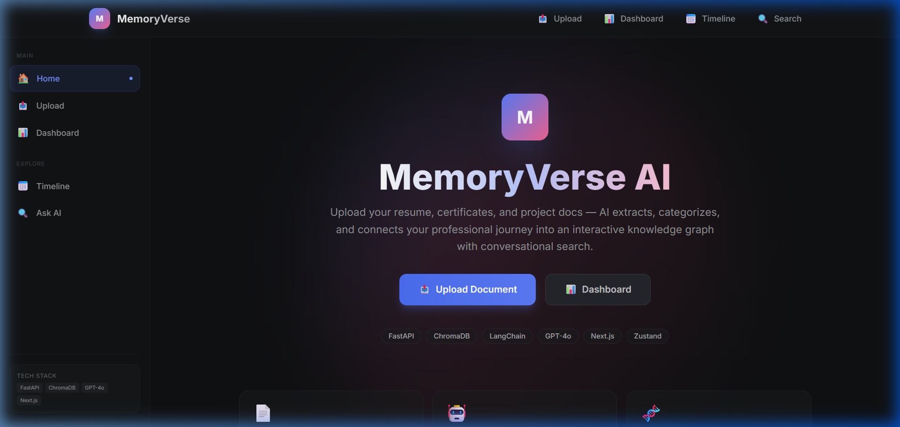
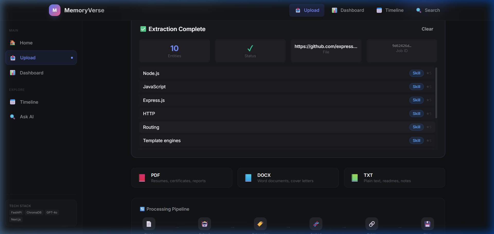
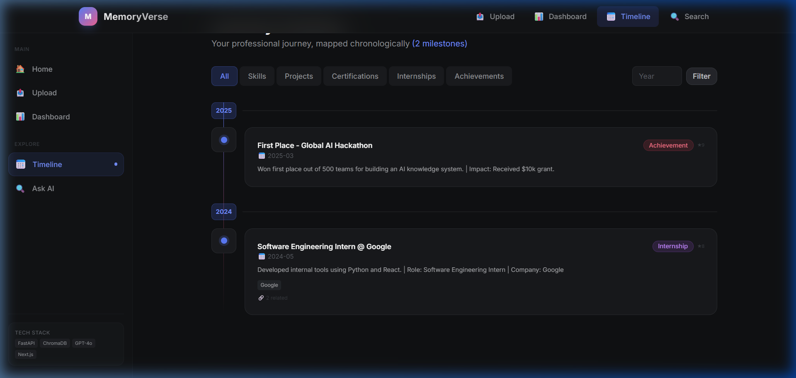
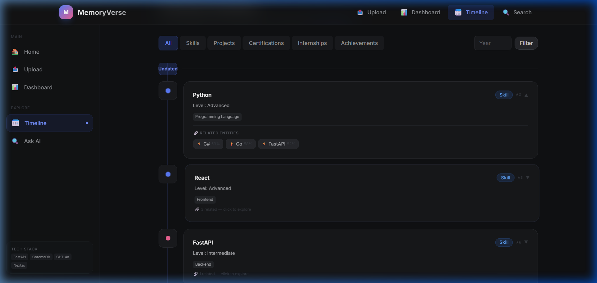
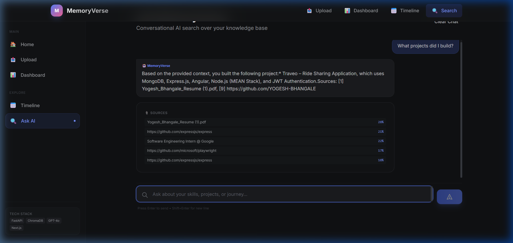
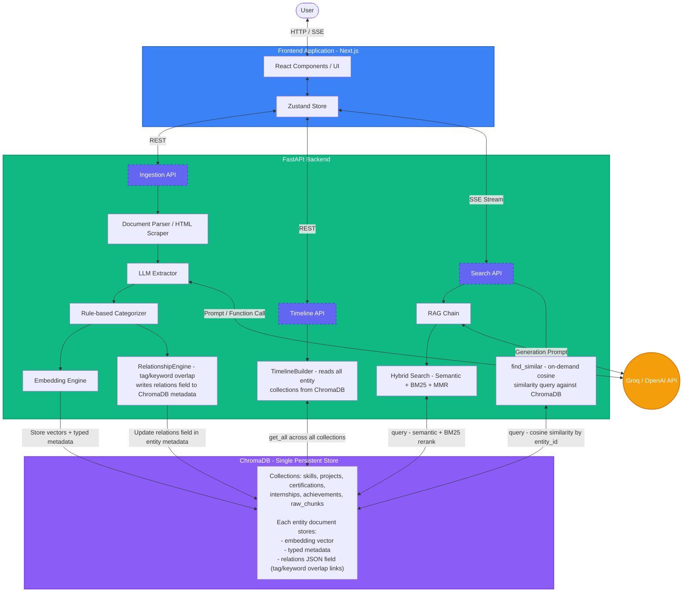

# MemoryVerse AI 🧠

> AI-powered personal knowledge management — upload your resume, certificates,
> and project docs, then explore your journey through an interactive timeline
> and intelligent search.

## Stack

| Layer       | Technology                                  |
|-------------|---------------------------------------------|
| Backend     | FastAPI + Python 3.11                       |
| LLM         | Groq (Llama 3.3-70B-versatile) + LangChain  |
| Embeddings  | Sentence-Transformers (`all-MiniLM-L6-v2`)  |
| Vector DB   | ChromaDB (persistent)                       |
| Frontend    | Next.js 14 + TypeScript + TailwindCSS       |

## Quick Start

### 1. Backend

```bash
cd backend
cp .env.example .env          # add your Groq API key
pip install -r requirements.txt
uvicorn app.main:app --reload
```

### 2. Frontend

```bash
cd frontend
cp .env.local.example .env.local
npm install
npm run dev
```

### 3. Docker (full stack)

```bash
docker-compose up --build
```

## 🎥 Demo

| Homepage | Upload & Extraction | Timeline | Related Connections | AI Search |
|----------|---------------------|----------|---------------------|-----------|
|  |  |  |  |  |

## 🛠️ Setup Instructions

### Prerequisites
- Python 3.11+
- Node.js 18+
- Docker & Docker Compose (optional)
- Groq API Key

### Option A: Quick Start (Docker)
1. Add your Groq API key to `backend/.env`
2. Run `docker-compose up --build`
3. Access the frontend at [http://localhost:3000](http://localhost:3000)

### Option B: Local Development
**Backend**
```bash
cd backend
python -m venv venv
# Windows: .\venv\Scripts\activate
# Mac/Linux: source venv/bin/activate
pip install -r requirements.txt
# Set GROQ_API_KEY in .env
uvicorn app.main:app --reload
```
API Documentation (Swagger): [http://localhost:8000/docs](http://localhost:8000/docs)

**Frontend**
```bash
cd frontend
npm install
npm run dev
```
App: [http://localhost:3000](http://localhost:3000)

### Seeding Demo Data
To quickly test the platform without uploading documents, you can run the seed script:
```bash
cd backend
python -m scripts.seed_demo
```

## API Endpoints

| Method | Endpoint                          | Description                     |
| ------ | --------------------------------- | ------------------------------- |
| POST   | `/api/ingest/upload`              | Upload PDF/DOCX/TXT             |
| POST   | `/api/ingest/link`                | Ingest data from a web URL      |
| GET    | `/api/ingest/status/{job_id}`     | Get parsing status              |
| GET    | `/api/timeline/{user_id}`         | Get chronological timeline      |
| POST   | `/api/search/query`               | Streaming RAG + Hybrid Search   |
| POST   | `/api/search/filter`              | Faceted metadata search         |
| GET    | `/api/search/similar/{entity_id}` | Find related/similar entities   |
| GET    | `/api/search/?q=...`              | Legacy semantic search          |
| GET    | `/api/identity/{user_id}`         | User profile summary            |
| GET    | `/health`                         | Health check                    |

## Architecture



## ✅ Resolved Improvements & Fixes

| Feature / Bug | Status | Technical Reality & Solution |
|---------------|--------|------------------------------|
| **Original File Retrieval** | **Resolved** | Upload pipeline saves raw file bytes to `UPLOAD_DIR` using a `file_id` indexed in ChromaDB metadata. Citations in Ask AI render clickable `GET /api/files/{file_id}` links opening original documents in browser. |
| **`document_to_entity` Parsing Crash** | **Resolved** | Fixed `json.JSONDecodeError` crash on empty string metadata from demo-seeded entities which previously dropped skills/projects/certifications from the timeline. |

## ⚠️ Known Limitations & Technical Realities

| Feature / Issue | Status | Technical Reality & Honest Impact |
|-----------------|--------|-----------------------------------|
| **Module 3 Relationships** | **Vector Similarity** | Implemented as on-demand cosine vector search (`GET /api/search/similar/{entity_id}`) directly against ChromaDB rather than a standalone graph database. |
| **Windows Memory Pressure / OOM** | **Known Issue** | `sentence-transformers` weight loading can fail under Windows virtual memory pressure (`OSError: paging file too small`). Restarting `uvicorn` loads from local disk cache. |

## License

MIT
