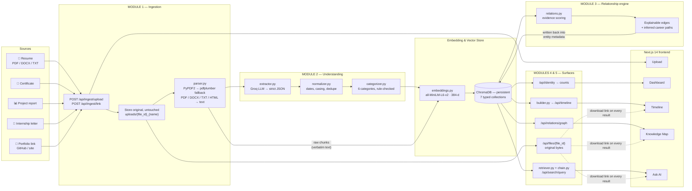
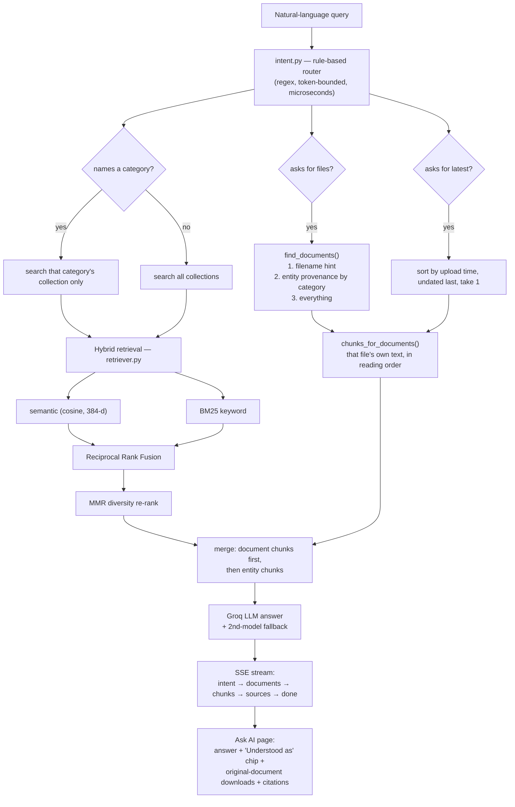

# MemoryVerse AI — AI Workflow & Architecture

MemoryVerse AI turns a pile of unsorted documents into a **connected, searchable
digital identity**. The user uploads; the system parses, extracts, categorises,
embeds, connects, and indexes. There is no folder to pick and no tag to type.

The originals are never modified. Every extracted fact keeps a pointer back to
the byte-identical source file, served from `GET /api/files/{file_id}`.

---

## 1. End-to-end pipeline



---

## 2. Text version (same flow, no renderer needed)

```
 ┌──────────────────────────────────────────────────────────────────────────┐
 │  UPLOAD  resume.pdf · certificate.pdf · project_report.docx · github URL │
 └──────────────────────────────┬───────────────────────────────────────────┘
                                v
 [1] INGESTION      POST /api/ingest/upload | /api/ingest/link
                    ├─ save original verbatim → uploads/{file_id}_{name}
                    └─ parse → text + page count        (parser.py)
                       PyPDF2, pdfplumber fallback on encrypted/empty PDFs
                                v
 [2] UNDERSTANDING  LLM extract  → strict JSON, 2-model fallback (extractor.py)
                    normalise    → ISO dates, casing, dedupe   (normalizer.py)
                    categorise   → skill | project | certification |
                                   internship | achievement | academics
                                   + importance score + tags   (categorizer.py)
                                v
 [3] EMBED & STORE  all-MiniLM-L6-v2 (384-d, local)          (embeddings.py)
                    ChromaDB persistent, 7 collections:
                      memoryverse_skills          memoryverse_internships
                      memoryverse_projects        memoryverse_achievements
                      memoryverse_certifications  memoryverse_academics
                      memoryverse_raw_chunks   ← verbatim text + file_id
                                v
 [4] RELATIONSHIPS  evidence-scored edges over the WHOLE corpus (relations.py)
                      certification --certifies--> skill
                      skill         --used_in----> project
                      project       --built_during-> internship
                      internship    --leads_to---> career path
                    each edge carries: relation_type, label, confidence,
                    evidence[] = {kind, detail, weight}
                    kinds: shared_tag · tech_match · name_match · temporal ·
                           mentioned_in · semantic · career_signal
                    edges persisted back into entity metadata
                                v
 [5] SURFACES       Timeline    GET  /api/timeline/{user}      (builder.py)
                    Ask AI      POST /api/search/query         (chain.py)
                                 └ intent router (intent.py)
                                 └ hybrid retrieval (retriever.py)
                    Faceted     POST /api/search/filter
                    Documents   GET  /api/search/documents
                    Graph       GET  /api/relations/graph/{user}
                    Identity    GET  /api/identity/{user}
                    Originals   GET  /api/files/{file_id}   ← unmodified bytes
                                v
 [6] FRONTEND       Next.js 14 · TypeScript · Tailwind · Zustand · framer-motion
                    Upload · Dashboard · Timeline · Knowledge Map · Ask AI
                    every card links back to its original file
```

---

## 3. Retrieval detail (Module 5)

The query is routed *before* anything is embedded, so a document request and a
knowledge request take different paths.



**Why a rule-based router instead of an LLM classifier:** it runs in
microseconds, cannot fail on malformed JSON, costs nothing, and is unit-testable.
The four demo query patterns route deterministically:

| Query | Router reads | Returns |
|---|---|---|
| "show all my certificates" | `categories=certification` | certification entities |
| "show my AI projects" | `categories=project` | project entities |
| "show internship documents" | `categories=internship; documents` | only the files that internships were actually extracted from, with download links |
| "show my latest resume" | `documents:resume; latest` | the newest resume file + its own text as context |

**How "internship documents" finds the right files.** No filename contains the
word "internship", so a filename hint alone matched nothing and the endpoint
listed every document the user had ever ingested — a GitHub profile link
included. Entity metadata records the `file_id` it came from, so the second step
inverts that: the documents that produced internship entities *are* the
internship documents. Only when neither step narrows anything does the full list
come back, because "what do I have?" is a better answer than an empty panel.

---

## 4. Why an edge exists (Module 3)

Vector nearest-neighbours cannot explain themselves. Each edge here is a sum of
named evidence, so the UI can always answer "why?":

```
 Python Certification ──certifies──> Python                confidence 0.82
   🏷️  Both tagged "python"                                      +0.35
   🔤  "Python" appears in the certification title                +0.30
   🕒  Issued 2 months before the skill first appears             +0.17

 Python ──used_in──> Sentiment Analysis Pipeline           confidence 0.74
   🛠️  Project tech stack lists Python                            +0.40
   📄  Both extracted from Yogesh_Bhangale_Resume.pdf              +0.20
   🧠  Semantic similarity 0.71                                    +0.14

 LSTM model design ──used_in──> RiverGuard                 confidence 0.50
   📄  Extracted from the same document, which describes
       only this project                                          +0.35
   🧠  Advanced-level skill (score 8/10)                           +0.10
   🕒  Applied around 2025-03                                      +0.05
```

**Same-document co-occurrence, and why it is guarded.** A project report names
the skills it demonstrated in prose ("LSTM model design") and its prize after the
organiser ("First Prize, Smart India Hackathon"), so neither matches the tech
stack nor shares words with the project title. Those entities used to sit
orphaned on the map beside the very project they came from. Co-occurrence fixes
it, but only for a document that is *about* one project — two tests, both
required:

1. the document produced exactly one project, **and**
2. it produced no internship, certification or academics entity.

Test 1 alone is not enough. A résumé that happens to describe a single project
passes it, and an early version of this rule duly attached that résumé's whole
career of skills — data structures, an IDE, an unrelated database — to that one
project: 27 wrong edges. Test 2 rejects it, because a document recording a degree
and a job is a career summary whatever its project count. A declared tech-stack
match still outranks co-occurrence (0.65–0.75 vs 0.50), so the ordering says
which edges are asserted by the document and which are inferred from it.

**`built_during` never contradicts the dates.** This edge claims a project
happened *within* an internship. When both carry dates and they sit more than
six months apart, that claim is false — so a shared language or skill alone no
longer manufactures it. The edge survives only if the internship's company is
named in the project itself, and then it is phrased as association ("done for
your … role, though built at a different time"), not as a temporal overlap.
Projects with no dates — the common résumé case — keep the tech/skill bridge, so
this only removes edges the dates actively refute.

The Knowledge Map lays categories out in the progression order
(Certifications → Academics → Skills → Projects → Internships → Achievements →
Career Paths), so an edge running left-to-right *is* the career progression.
Clicking any node lists its edges with the evidence above.

---

## 5. Component map

| Layer | File | Responsibility |
|---|---|---|
| API | `app/main.py` | FastAPI app, CORS, router registration |
| API | `app/api/routes/ingest.py` | upload / link ingestion pipeline |
| API | `app/api/routes/search.py` | RAG query, faceted filter, similar, documents |
| API | `app/api/routes/relations.py` | graph, entity connections, legend, rebuild |
| API | `app/api/routes/timeline.py` | chronological journey |
| API | `app/api/routes/identity.py` | profile, top skills, per-category counts |
| Ingest | `core/ingestion/parser.py` | PDF / DOCX / TXT / HTML → text |
| Ingest | `core/ingestion/extractor.py` | Groq LLM → strict JSON, model fallback |
| Ingest | `core/ingestion/normalizer.py` | date / casing / dedupe normalisation |
| Ingest | `core/ingestion/categorizer.py` | 6-way classification, defensive parsing |
| Vector | `core/vectordb/embeddings.py` | Sentence-Transformers + Chroma writes |
| Vector | `core/vectordb/client.py` | persistent client, 7 typed collections |
| Graph | `core/vectordb/relations.py` | evidence scoring, career-path inference |
| RAG | `core/rag/intent.py` | rule-based query router |
| RAG | `core/rag/retriever.py` | semantic + BM25 + RRF + MMR, document lookup |
| RAG | `core/rag/chain.py` | prompt, answer generation, SSE streaming |
| Timeline | `core/timeline/builder.py` | year grouping, inline explainable relations |
| Frontend | `src/lib/api.ts` / `store.ts` | typed client, Zustand state |
| Frontend | `src/components/graph/KnowledgeMap.tsx` | explainable graph view |
| Frontend | `src/components/timeline/TimelineView.tsx` | journey + "why this connects" |

---

## 6. Stack

**Backend** FastAPI · Python 3.11 · LangChain (`langchain-groq`,
`langchain-huggingface`) · Groq (`openai/gpt-oss-120b`, fallback
`openai/gpt-oss-20b`) · Sentence-Transformers `all-MiniLM-L6-v2` · ChromaDB
(persistent) · PyPDF2 with pdfplumber fallback / python-docx / BeautifulSoup ·
pytest

**Frontend** Next.js 14 (App Router) · TypeScript · TailwindCSS · Zustand ·
framer-motion · Recharts

**Design guarantees**

1. **Originals are immutable.** Bytes are written once and only ever read back.
2. **Zero manual organisation.** No folder picker, no tag input, anywhere.
3. **Every claim is traceable.** Entity → `file_id` → original document.
4. **Every connection is explainable.** No edge without evidence.
5. **Graceful degradation.** Two LLM models; retrieval survives both failing;
   undated records still render (sorted last, never faked).
